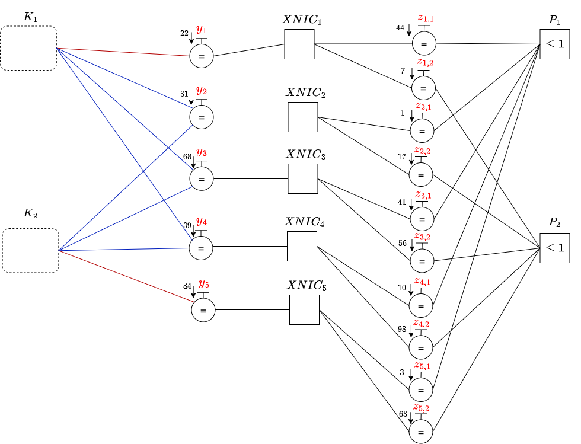

# **IMPALIB**

## Table of Contents

* [Introduction](#introduction)
* [Applications](#applications)
* [Supported Constraints](#supported-constraints)
* [Code Parameters](#code-parameters)
* [Usage](#usage)
* [Requirements and Installation](#requirements-and-installation)
* [Unit Testing](#unit-testing)
* [License](#license)

## **Introduction**

Would you like to solve optimization problems using message-passing algorithms? And would you like perform Belief Propagation in C++ and Python? Then **IMPALIB** (Iterative Message Passing Algorithm Library) is exactly for you.

***IMPALIB***:

* Can be used in three different ways:
  1. A small header-only library written in modern and pure C++
  2. Pure Python code
  3. C++ code with a Python wrapper
* Is easy to use and integrate with existing code
* Is self-contained and depends only [cnpy](https://github.com/rogersce/cnpy) library for unit testing - another header-only library which is used for reading and writing `numpy` files
* Supports inference for optimization problems with various possible constraints

## **Applications**

* *Application 1* :

  We considered a first application of team formation and assignment problem based on a matrix management structure. We assumed that there are $N_d$ departments, with department $d$ comprising $S_d$ employees of a given specialty (e.g., hardware, systems, software, etc.). A total of $N_t$ teams are considered for formation by drawing from these departments. For example, a given team may require $2$ software engineers, $1$ hardware engineer and no systems engineers. The binary variable $y_t \in {0, 1}$ indicates whether team $t$ is formed. Each of the formed teams can be assigned to one of $N_p$ projects. The cost of forming team $t$ is $c_T(t)$ and the cost of matching team $t$ to project $p$ is $c_P(t, p)$. These costs will vary based on the team composition and how well a team matches the project needs. The problem of optimal team formation is a multiple knapsack problem and the team-project assignment is a weighted matching problem. We focused on the joint optimization of these two problems.
* *Application 2* :
  
  We also considered solving the Traveling Salesperson Problem (TSP) to determine the shortest possible route passing through a set of $N$ cities exactly once and returning to the starting point. In this case, cities are represented as nodes and their connections as edges within a graph. The challenge lies in finding an optimal Hamiltonian cycle in this graph while considering the distances between cities.
* *Application 3* :
  
  We also considered solving the $k$-SAT problem where the goal is to determine whether there exists an assignment of variables in a Boolean formula with clauses containing exactly $k$ variables, such that the entire formula is true.

## **Supported Constraints**

Various constraints are implemented:

1. Equality Constraints which allow multiples copies of a variable
2. Inequality Constraints ($\le 1$):
   * The all-zero configuration has a zero configuration metric
   * The other configurations have exactly one edge variable taking the $1$ value
3. XNIC Constraints:
   * These constraints do not allow matching to a project if a team is not formed
   * These constraints only allow matching to exactly one project if a team is formed
4. Knapsack Constraints:
   * These constraints enforce that the team assignments do not violate the capacity of each department
5. Degree Constraints which enforce that each city must be visited exactly once
6. Subtour Elimination constraints prevent the existence of smaller loops or subtours within potential solutions
7. K-SAT constraint ensures that a constraints is satisfied by the constituent variables (solid or dashed connections)

### **Code Parameters**

1. Common variables to *Applications 1, 2, & 3*:
   * `nITER`: Number of iterations of the IMPA
   * `filteringFlag`: whether filtering is activated or not
   * `alpha`: filtering coefficient ($0\le \alpha \lt 1$)
   * `PPFlag`: whether post-processing is activated or not
   * `threshold`: threshold value to make hard-decisions
2. Variables related to *Application 1*:
   * `PPOption`: type of post-processing ($1$-perform post-processing on departments, $2$-perform post-processing on teams)
3. Variables related to *Application 2*:
   * `symFlag`: whether to use symmetrical graphical model or not
   * `augmFlag`: whether to solve the augmented TSP or relaxed one
   * `lkhSolFlag`: Run LKH algorithm to find a tour
   * `resetFlag`: whether to reset messages at each augmentation step or not
   * `randomTestFlag`: whether to run IMPA on a graphical model with random cost values or from a pre-generated input files
   * `inputPath`: If randomTestFlag is not set to True, specify the inputs path
   * `maxCount`: Maximum count of invalid configurations before stopping the IMPA. This will allow IMPA to exit when singular solutions are encountered consecutively
   * `maxAugmCount`: Maximum number of augmentation steps. This will allow IMPA to exit when no tour was found up to a certain number of augmentation steps
   * `KOPTFlag`: whether to perform K-opt algorithm on the obtained tour (only $2$-opt and $3$-opt are investigated to avoid the curse of dimensionality)
4. Variables related to *Application 3*:
   * `nVariables`: Number of variables to select from to build the constraints
   * `nConstraints`: Number of constraints in the formula
   * `kVariable`: Number of variables per constraint
   * `PPElements`: Size of a combination in the third step of the post-processing algorithm
   * `typeMetrics`: Type of Normal distribution the incoming metrics are sampled from
   * `var`: Variance of the Normal distribution used to set the incoming metrics
   * `overwrite`: whether to over-write the type of metrics in a pre-generated input files for analysis with a different type of incoming metrics initialization
   * `randomTestFlag`: whether to run IMPA on a random instant or from a pre-generated input files

## **Usage**

There are three different ways for implementing **IMPALIB**:

  1. Using a header-only C++ library
  2. Using a pure Python code which is relatively slow
  3. Using a C++ code with a Python wrapper which is relatively fast

### **1. Header-Only C++ Library**

The headers in the `include` directory can be directly copied to your project.
We assume in the code samples below you've copied them to an `impalib` subdirectory of one of your project's include directories

* Include header files of the library:

  ```cpp
      #include "impalib/impalib.hpp"
  ```

* Demo code for each of the applications can be found in the following files:
  * [Application $1$](examples/KcMwm/demo.cpp)
  * [Application $2$](examples/Tsp/demo.cpp)
  * [Application $3$](examples/Ksat/demo.cpp)

<!--Graphical Model of Application $1$:

- reward_team and reward_project are represented by arrows on the left and right equality constraints, respectively.
- teams_weights_per_department are represented by red (weight $=2$) or blue (weight $=1$) edges.

-->

* To run any of the above demos:
  * Navigate to: ``IMPALIB/examples/KcMwm`` or ``IMPALIB/examples/Tsp``
  * Run: ``cmake -B build``
  * Run: ``cmake --build build``
  * Run: ``cd build``
  * Run: ``./demo``

### **2. Pure Python code**

To run pure code using sample datasets:

* *Application $1$*:
  * Navigate to ``IMPALIB/test/python_kc_mwm/src``
  * Run:

    ```bash
        python3 main_pure_optimized.py --nITER=400 --filteringFlag=True --alpha=0.9 --PPFlag=True --threshold=-0.0001
    ```

* *Application $2$*:
  * Navigate to ``IMPALIB/test/python_tsp/src``
  * Run:

    ```bash
        python3 main_tsp.py --nNodes=10 --filteringFlag=True --alpha=0.5 --augmFlag=True --threshold=-0.0001 --nITER=200 --randomTestFlag=True
    ```

* *Application $3$*:
  * Navigate to ``IMPALIB/test/python_ksat/src``
  * Run:

    ```bash
        python3 main_ksat.py --filteringFlag=True --threshold=-0.0001 --nITER=200 --alpha=0.5 --randomTestFlag=True --nConstraints=20 --nVariables=10 --kVariable=3
    ```

### **3. C++ Code with a Python wrapper**

To compile the C++ library and install the Python wrapper, navigate to the project root and use:

  ```bash
      python3 -m pip install . -v
  ```

* Navigate to ``IMPALIB/src/impa``
* For *Application $1$*:
  * To run wrapper code using sample datasets, Run:
  
    ```bash
        python3 main_kc_mwm.py --nITER=400 --filteringFlag=True --alpha=0.9 --PPFlag=True --PPOption=1 --threshold=-0.0001
    ```

* For *Application $2$*:
  * To run wrapper code using sample datasets:

    ```bash
        python3 main_tsp.py --filteringFlag=True --alpha=0.5 --augmFlag=True --threshold=-0.0001 --nITER=200 --inputPath=inputs_1000_nNodes_random --testFile=0 --lkhSolFlag=True --maxAugmCount=10
    ```

  * To run wrapper code using randomly generated cost values:

    ```bash
        python3 main_tsp.py --nNodes=10 --filteringFlag=True --alpha=0.5 --augmFlag=True --threshold=-0.0001 --nITER=200 --randomTestFlag=True --lkhSolFlag=True --maxAugmCount=20
    ```

* For *Application $3$*:
  * To run wrapper code using sample datasets:

    ```bash
        python3 main_ksat.py --filteringFlag=True --threshold=-0.0001 --nITER=200 --inputPath=inputs_ksat_zeromean_var_10_samples_500 --outputPath=outputs_ksat_zeromean_var_10_samples_500 --PPElements=2 --testFile=112 --alpha=0.5 --var=8 --typeMetrics=2 --overwrite=1 --PPFlag=True
    ```

  * To run wrapper code using randomly generated cost values:

    ```bash
        python3 main_ksat.py --filteringFlag=True --threshold=-0.0001 --nITER=200 --PPElements=2 --alpha=0.5 --var=8 --randomTestFlag=True --nConstraints=200 --nVariables=90 --kVariable=5 --PPFlag=True
    ```

**Note**: Currently this option looks for a relevant sample dataset in the `data` directory, one directory up from the current working directory.
This will be fixed in a future version.

## **Requirements and Installation**

* A C++ $11$ - compatible compiler
* Python $3.9.7$
* To perform unit testing: randomized simulations using a pure Python code and a Python wrapper around a C++ code are carried out for both applications. A checking routine on the stored numpy files is executed to compare results. An external library called [cnpy](https://github.com/rogersce/cnpy) is used to save and load numpy arrays in C++

## **Unit Testing**

Refer to the README file for the [Unit Testing](test/README.md) framework.

## **License**

Distributed under the MIT License.
See accompanying file [`LICENSE`](https://github.com/RustomAlexios/IMPALIB/blob/main/LICENSE) or at
([https://opensource.org/licenses/MIT](https://opensource.org/licenses/MIT))
